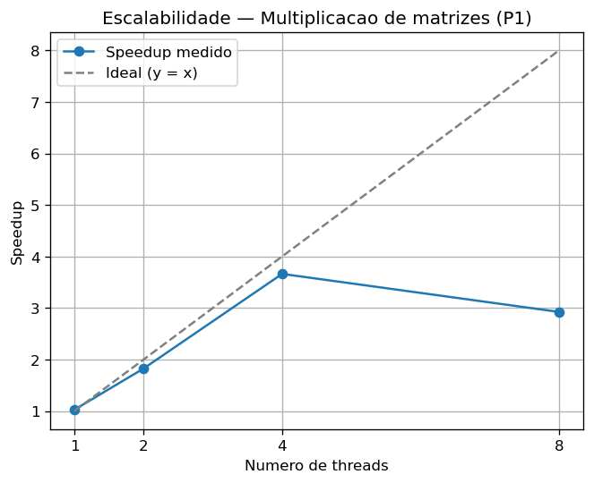

# Trabalho Prático 1 — LPII (UFPB, 2026.1)

**Nome:** Gabriel Fernandes Paiva
**Matrícula:** 20230146371
## Problema escolhido

**P1 — Multiplicação de matrizes.**

O programa multiplica duas matrizes densas `n × n` (`C = A · B`), armazenadas em
*row-major* (`A[i*n + j]`). É um problema **CPU-bound**: o custo é `O(n³)`
multiplicações/somas de ponto flutuante, dominado por aritmética e acesso a
memória, sem I/O. A paralelização é feita por **mapa por linhas**: as `n` linhas
de `C` são divididas em blocos contíguos entre as `T` threads, e cada thread
calcula apenas suas linhas (escrita em posições **disjuntas**, sem estado
compartilhado nem *merge*). A **âncora de corretude** é a versão sequencial
`multiplicar()`: o resultado paralelo é comparado elemento a elemento com ela
(tolerância `|dif| < 1e-6`) e por dois checksums.

## Como compilar e executar

**Via CMake:**

```bash
cmake -B build -DCMAKE_BUILD_TYPE=Release && cmake --build build
./build/matmul 4
```

**Comando gcc único:**

```bash
gcc -O2 -Wall -Wextra -pthread src/*.c -o matmul && ./matmul 4
```

**Variando o número de threads:** passe como 1º argumento (`argv[1]`):

```bash
./matmul 1     # sequencial de referência (speedup ≈ 1.0)
./matmul 8     # 8 threads
```

Se o argumento for omitido, o programa usa como *default* o número de núcleos
lógicos disponíveis (ou 4) e avisa no `stderr`.

**Varredura de escalabilidade (1, 2, 4, 8 threads) + gráfico:**

```bash
bash scripts/run_scaling.sh
```

Isso gera `scripts/results.csv` e `scripts/scaling.png`.

## Ambiente de teste (OBRIGATÓRIO)

| Item | Valor |
|---|---|
| CPU (modelo) | Intel Core i5-1135G7 @ 2.40GHz (11ª geração) |
| Núcleos físicos / lógicos | 4 / 8 (hyperthreading) |
| Compilador + versão | gcc 13.3.0 |
| Flags | `-O2 -Wall -Wextra` (+ pthreads) |
| Sistema operacional | Ubuntu 24.04.2 LTS |

Como obter:

- **Linux:** `lscpu` (modelo, núcleos físicos/lógicos), `gcc --version`,
  `cat /etc/os-release`.
- **macOS:** `sysctl -n machdep.cpu.brand_string` (modelo),
  `sysctl -n hw.physicalcpu hw.logicalcpu` (núcleos).

> ⚠️ **Não meça em ambiente online/compartilhado** (Replit, Codespaces, etc.):
> os núcleos são compartilhados e a frequência varia, então os tempos e o
> speedup ali **não são confiáveis**. Rode em uma máquina dedicada e preencha
> a tabela acima com os dados dela.

## Q2 — Baseline (versão sequencial)

- `T_seq` (mediana de 5 execuções, descartando a 1ª de aquecimento) =
  **2.650 s** (n = 1200)
- Âncora de corretude validada: comparação elemento a elemento (`|dif| < 1e-6`)
  e checksums `C_seq`/`C_par` impressos pelo programa → **OK**.

## Q3 — Speedup (números REAIS da sua máquina)

Rode `./matmul <nº de núcleos>` e copie os valores impressos.

| Threads | Tempo (s) | Speedup |
|---------|-----------|---------|
| 1 (seq) | 2.650 | 1.00× |
| 4 (núcleos físicos) | 0.724 | 3.66× |

A verificação automática imprime **OK** quando `C_par` confere com `C_seq`
dentro da tolerância.

## Q4 — Escalabilidade

Tabela com ≥ 4 pontos (números REAIS — preencha com `scripts/results.csv`):

| Threads | Tempo (s) | Speedup | Eficiência |
|---------|-----------|---------|------------|
| 1 | 2.587 | 1.02× | 1.02 |
| 2 | 1.452 | 1.83× | 0.91 |
| 4 | 0.724 | 3.66× | 0.92 |
| 8 | 0.907 | 2.92× | 0.37 |

> Eficiência = speedup / nº de threads. Speedup tomando como referência o
> `T_seq` (mediana) do run com 1 thread. O speedup ≈ 1.0 com 1 thread confirma que
> só a computação está no cronômetro (a pequena variação para 1.02 é ruído de
> medição); com 4 threads a eficiência fica em ~0.92 (um núcleo físico por thread)
> e despenca em 8 threads, pois há apenas 4 núcleos físicos (os outros 4 são
> hyperthreading).



### Discussão — por que o speedup não é linear

Nos dados medidos, o speedup cresce quase idealmente até **4 threads**
(3.66×, eficiência ~0.92) e depois **regride** em 8 threads (2.92×): a máquina
tem apenas **4 núcleos físicos** (os outros 4 são hyperthreading), então passar
de 4 para 8 threads não adiciona unidades de execução reais — só intensifica a
disputa. O speedup fica **abaixo da reta ideal** (`y = x`) por uma combinação de
fatores:

1. **Parcela sequencial (Lei de Amdahl).** Parte do trabalho não é paralelizável
   (alocação fica fora do cronômetro, mas a criação/junção das threads e a
   divisão das fatias são intrinsecamente seriais). Como o speedup máximo é
   limitado por `1 / (s + (1-s)/T)`, qualquer fração serial `s` impede o ganho
   linear, e o efeito se acentua conforme `T` cresce.

2. **Limite de banda de memória.** A multiplicação naive percorre a coluna de `B`
   (acesso com passo `n`, pouco *cache-friendly*) gerando muito tráfego entre
   cache e RAM. Vários núcleos disputam o **mesmo barramento/controlador de
   memória**, então, a partir de certo `T`, o gargalo deixa de ser CPU e passa a
   ser banda de memória — adicionar threads rende cada vez menos.

3. **Overhead de criação/junção de threads.** Cada execução cronometrada inclui
   `pthread_create` + `pthread_join` de `T` threads. Esse custo fixo é diluído
   com matrizes grandes (por isso o run de 1 thread fica em ~1.0×), mas cresce
   com `T` e, somado à divisão das fatias, corrói parte do ganho.

4. **Hyperthreading (4 núcleos físicos).** De 4→8 threads, dois *threads* lógicos
   compartilham as mesmas unidades de execução e o mesmo cache L1/L2 de um núcleo
   físico; como a multiplicação já satura essas unidades, o ganho some e a
   contenção por banda de memória (fator 2) ainda piora, derrubando a eficiência
   de ~0.92 para ~0.37.

O **false sharing é pequeno** aqui, porque cada thread escreve em blocos
**contíguos de linhas** (regiões de memória bem separadas), evitando que duas
threads disputem a mesma linha de cache na escrita de `C`.
